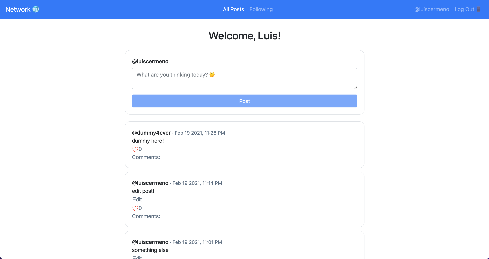

# Project 4 "Network"
Author: Luis Cermeno

The Social Network App features a feed-based interface for users to easily share, like and commnent posts. Users are able to follow and unfollow other users. A potential upgrade to the project is implementing follow suggestions by using a graph data structure to model user friendships.

## How to Run
(Must have Docker installed)

1. Run:  
`docker pull luiscermeno/network`  
`docker run -p 8000:8000 luiscermeno/network`

2. Go to "localhost/8000" in your web browser

You can also replace the port in which the app will run. For this, have the docker image map the vm port to the port of your selection:  
`docker run -p [PORT]:8000 luiscermeno/network`  

## Runtime
python=3.10.4
